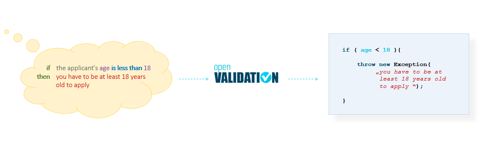
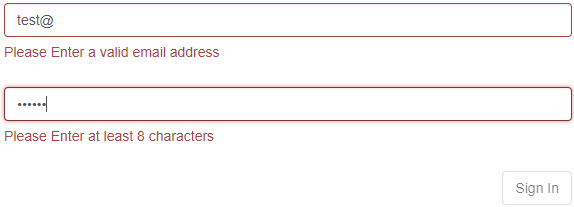

# open\* what?

openVALIDATION enables programming of complex validation rules using natural language, such as German or English. 

The rules recorded in natural language are readable not only by humans but also by machines and therefore no longer need to be programmed by a software developer. This task takes over now openVALIDATION. With integrated code generators, a corresponding code can be generated automatically in the desired programming language such as Java, C\#, JavaScript with more to come. This code can then be integrated into any application \(services, frontends, middleware\). 

_Write once, DONT CODE and run everywhere!_

\_\_

  
[ __](http://download.openvalidation.io/ov-openapi-generator-cli.jar)\_\_

\_\_

### Natural grammar

Grammar based on a natural language is both **formal** and **natural**. This distinguishes this grammar from other programming languages or domain-specific languages. It allows the use of additional semantic or grammatical content. The additional content is only relevant for human readability. The machine, on the other hand, ignores this addition. Thus it is possible to express the rules grammatically correct on the one hand and to give the rules a semantic context on the other hand. All this makes the rules easier to understand. The rules formulated with openVALIDATION are thus at the same time a formal, machine-processable specification, and also a documentation that is easy for people to understand.

### What are validation rules?

Every time data is transmitted, it must be checked for correctness. Such a check is also called plausibility check or **validation**. There are usually several checks, whereby one of them is called a **validation rule**.

Validation rules are often required in user interfaces, services, CLI's or at different places in business processes, i.e. everywhere where data is processed. Here is an example that is certainly familiar to everyone:

Two different validation rules are implemented here. The first rule checks the format of the e-mail address. And the second rule checks the length of the password. This is certainly a very simple example. With the complexity of the application, the complexity of the validation rules also increases. For example, an online form for the conclusion of a motor vehicle insurance policy can contain well over 1000 validation rules. 

