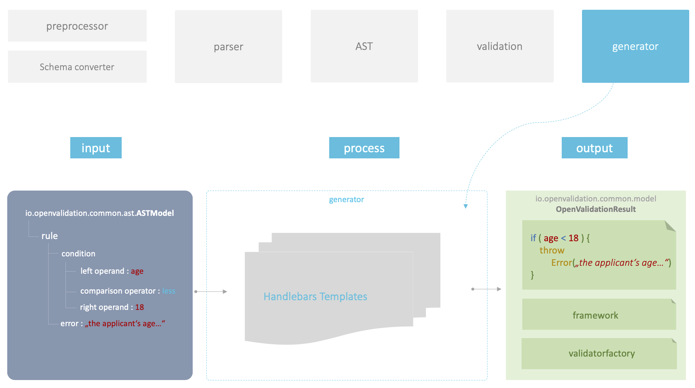

# Architecture

At this point the core functionality and the corresponding architecture of **openVALIDATION** is described. This description does not include the CLI or REST component. A natural language rule and the corresponding schema are expected as input parameters. Afterwards the processing starts, which can be separated into 5 subroutines \(preprocessor, schema converter, parser, validation, generator\). At the end of the compilation process program code is generated.


The preprocessor prepares the natural language rule. At this point, for example, a translation or normalization of the keywords \(aliases\) takes place. The parser generates the Abstract Syntax Tree \(AST\). The AST is the logical structure of the grammar, which in our case represents the domain of the validation rules. The AST is then processed further with the help of the generator, so that valid program code is generated at the end of the entire processing procedure.


### Rule

openVALIDATION makes it possible to describe validation rules in a natural language. Strictly speaking, there are many different languages such as **German** or **English**. The languages are extensible, so you can add more languages like **Spanish** or **French** with a manageable effort.

In order for openVALIDATION to extract a valid validation rule from a raw text the special keywords must be included in this text. There is a set of fixed keywords. Each of these keywords has one or more aliases in the respective language. For example, the keyword **should not** has additional aliases such as: **must not** or **have not** . Each keyword has a normalized value for which several aliases exist in each natural language. The configuration of these aliases can be found in the [Resources](https://github.com/openvalidation/openvalidation/tree/master/openvalidation-core/src/main/resources) folder of the [openvalidation-core](https://github.com/openvalidation/openvalidation/tree/master/openvalidation-core) project.

Here is an excerpt from [aliases\_en.properties](https://github.com/openvalidation/openvalidation/blob/master/openvalidation-core/src/main/resources/aliases_en.properties) where the English language aliases are defined.

```typescript
...

ʬoperatorʬequals = IS, EQUAL, EQUALS, IS EQUAL TO
ʬoperatorʬnot_equals = ISN'T, IS NOT, NOT EQUAL, NOT EQUALS, NOT

...
```

Die Auflösung bzw. die Normalisierung dieser Aliases erfolgt im Preprocessor. 

Any text can be placed around the keywords. We call it sematic sugar. Thanks to this **semantic sugar**, the creator can make his rules very flexible and describe the set of rules in much more detail. Other editors can better understand the rules while the machine simply ignores the semantic sugar. This flexibility is the core of the grammar of openVALIDATION. It makes it so natural compared to other DSL's.

For example, it would be quite sufficient to describe the rule in this way. For the compiler this would be enough:

```typescript
age must less 18
```

However, it is not so nice for humans to read. The age of who? 18 what? For human understanding you need a little more context:

```csharp
applicant's age should not be less than 18 years
```

It sounds much more natural. The larger and more complex the set of rules is, the more useful the ability of the semantic context proves to be. Another advantage arises when you dictate the rule instead of writing it. Thus, voice assistants can be equipped with the ability to generate code or to store rules.


### Schema

A validation rule always requires a data model or schema so that it knows which data is to be validated. Usually a data model already exists before you start to create validation rules. Therefore openVALIDATION compiler expects the corresponding schema in addition to the actual set of rules.


It is not the task of openVALIDATION to create a data model or a schema. The schema must be passed to openVALIDATION as input parameter.


The schema must be currently defined in [JSON Schema](https://json-schema.org/) format. To simplify the use of openVALIDATION, the schema can also be defined in  [JSON](https://www.json.org/) Object Format. From this a possible JSON schema is automatically derived which is then further processed.

Here is an example of a possible schema:

```javascript
{
  "$schema": "http://json-schema.org/draft-07/schema#",
  "type": "object",
  "properties": {
    "age": {
      "type": "number",
    }
  }    
}
```

The schema actually defines a single attribute named **age** and of **type** **number**. It is quite complex if you just want to fire a CLI command or just try it out. Therefore openVALIDATION offers the possibility to specify the schema in a simple **JSON object format**:

```javascript
{
    age : 0
}
```

This is a simple way to pass the same information to the compiler. An attribute **age** that contains a value of **0**. You can also pass another value, but the value will be ignored. It is only used to determine the **data type** of the attribute.


If you want to realize a deeper integration of openVALIDATION into other systems it is always recommended to use JSON Schema instead of JSON Object. This allows a schema to be specified much more precisely.



### Schema converter

openVALIDATION needs the schema to parse the natural language rule. All attributes of the schema are therefore loaded into the [DataSchema](https://github.com/openvalidation/openvalidation/blob/master/openvalidation-common/src/main/java/io/openvalidation/common/data/DataSchema.java) component. To do this, the schema must be read and converted into the appropriate format. Since the schema itself can be specified in various formats, such as JSON Schema or JSON Object and later also in yaml or xsd, there is a [SchemaConverterFactory](https://github.com/openvalidation/openvalidation/blob/master/openvalidation-common/src/main/java/io/openvalidation/common/converter/SchemaConverterFactory.java). It provides the corresponding implementation of a specific converter depending on the type of schema.


Each converter must implement the [ISchemaConverter](https://github.com/openvalidation/openvalidation/blob/master/openvalidation-common/src/main/java/io/openvalidation/common/converter/ISchemaConverter.java) interface and the DataSchema **convert\(\)** method. The task of the converter is to run through the hierarchy of the schema and convert each attribute with all relevant meta informations, such as name, type, path/full name, and so on, into a flat structure of the DataSchema.

Here is an example. The following schema is given:

```javascript
{
    age:0,
    address : {
        city : ""
    }
}
```

After the conversion the following information is in the DataSchema \(pseudo YAML format\):

```javascript
_properties:
    DataProperty:
        name : "age"
        path : ""
        fullName : "age"
        type : "Decimal"
    DataProperty:
        name : "address"
        path : ""
        fullName : "address"
        type : "Object"
    DataProperty:
        name : "city"
        path : "address"
        fullName : "address.city"
        type : "String"                

        
```

Thanks to this metadata, all relevant information can be extracted from a natural language rule. Among other things, this construct allows recursive name resolution of schema attributes. For example, you could directly use the attribute city without specifying the full name address.city like in a formal programming language. If city occurs more than once in schema, it will be validated later and the user will get a compiler message that he has to use the full name because of ambiguity.

**DataSchema**

The DataSchema component stores not only the schema information but also the [variables](../../grammatik/variablen.md) and [semantic operators](../../grammatik/domainspezifische-operatoren.md). However, this information is added at a later time after the first parsing routine.

By keeping the type information available during parsing, especially the operands of a condition can be determined and extracted. For example, if you know that the left operand is an attribute from the schema of type decimal and the right operand simply contains text, you can try to extract a numeric value from this text. If no numeric value is found, you can then throw a relatively unique compiler message.


### Preprocessor

Before a natural language rule can be parsed, the corresponding text must be prepared. For example, the keywords or the paragraphs must be normalized. Includes must be resolved or it must be checked if there are collisions with different keywords and so on.

These are many small routines that prepare the original text. This processing logic has also been modularized. So there are many small preprocessors that perform the individual tasks one after the other.


Every single step of the whole preprocessor routine is implemented in a separate module. Each of these modules must be derived from the abstract base class [PreProcessorStepBase](https://github.com/openvalidation/openvalidation/blob/master/openvalidation-core/src/main/java/io/openvalidation/core/preprocessing/PreProcessorStepBase.java). Afterwards the method **String process\(String rule\)** must be overwritten and provided with the respective logic. Currently, the following modules can be found in the package [io.openvalidation.core.preprocessing.steps](https://github.com/openvalidation/openvalidation/tree/master/openvalidation-core/src/main/java/io/openvalidation/core/preprocessing/steps):

[PreProcessorAliasResolutionStep.java](https://github.com/openvalidation/openvalidation/blob/master/openvalidation-core/src/main/java/io/openvalidation/core/preprocessing/steps/PreProcessorAliasResolutionStep.java)

[PreProcessorIncludeResolutionStep.java](https://github.com/openvalidation/openvalidation/blob/master/openvalidation-core/src/main/java/io/openvalidation/core/preprocessing/steps/PreProcessorIncludeResolutionStep.java)

[PreProcessorKeywordCollisionStep.java](https://github.com/openvalidation/openvalidation/blob/master/openvalidation-core/src/main/java/io/openvalidation/core/preprocessing/steps/PreProcessorKeywordCollisionStep.java)

[PreProcessorLastParagraphCleanup.java](https://github.com/openvalidation/openvalidation/blob/master/openvalidation-core/src/main/java/io/openvalidation/core/preprocessing/steps/PreProcessorLastParagraphCleanup.java)

[PreProcessorVariableNamesStep.java](https://github.com/openvalidation/openvalidation/blob/master/openvalidation-core/src/main/java/io/openvalidation/core/preprocessing/steps/PreProcessorVariableNamesStep.java)



Further modules can be implemented here without problems. It is very important to keep the order in which the individual modules are executed.


#### Resolving the keywords

The resolution of keywords is one of the most important tasks of the preprocessor. It involves converting the large number of aliases into a normalized form. The following parsing process only knows the normalized keywords and not their aliases.

And this is how it looks like. We have the following rule:  


```javascript
applicant's age should not be less than 18 years
```

The preprocessor makes of it:

```javascript
the applicant's age 
ʬconstraintʬmustnotʬshould_20_not be ʬoperatorʬless_20_thanʬless 
than 18 years

```

**should not** became **ʬconstraintʬmustnotʬshould\_20\_not** where the last part ...**should\_20\_not** is dynamic. At this point, the original form is preserved so that it is available after the parsing process, for example, for compiler messages or for other purposes. The front part **ʬconstraintʬmustnotʬ** is normalized. This is the part the parser knows. 


The resolution of the aliases depends on the Culture Code used. When using e.g. **de**, only aliases from the German resource [aliases\_en.properties](https://github.com/openvalidation/openvalidation/blob/master/openvalidation-core/src/main/resources/aliases_de.properties) are used.



### Parser

Das Parsen ist wahrscheinlich der bedeutendste und gleichzeitig auch der komplexeste Verarbeitungsschritt in openVALIDATION. Eines der Gründe für die besondere Komplexität ist die Flexibilität der Grammatik bzw. der Natürlichen Sprache. In formalen Programmiersprachen aber auch in den meisten DSL's und vor allem in den stark typisierten Objektorientierten Programmiersprachen hat jedes Wort, jedes Zeichen eine sehr genaue Bedeutung. Die Eingabe muss sehr genau erfolgen ansonsten gibt es sofort einen Compilerfehler. 

Beim design der Grammatik von openVALIDATION war uns sehr wichtig, dass solche Restriktionen für die normalen Anwender\(Nicht-Entwickler\) oft hinderlich sind. Deshalb bietet openVALIDATION sehr viele Varianten, wie man eine Regel auf eine möglichst natürliche Weise ausdrücken kann. 

```javascript
if user's age is less than 18 years then underage persons are not admitted
```

oder

```javascript
the applicant's age must not be less than 18 years
```

Beide Regeln werden vom Compiler in folgenden Code übersetzt. Hier in Pseudo Code:

```javascript
if (age < 18)
    throw Error("underage persons..." or in the 2nd case "the applicant's..")
```

Der Compiler versucht erst einmal die Eingaben so zu akzeptieren wie es dem Benutzer am besten passt, um anschließend daraus den relevanten Teil zu extrahieren, ohne dabei den Benutzer dazu zu zwingen eine bestimmte Schreibweise einzuhalten. Dadurch ist die Lernkurve bei Newbies extrem Steil. Sie müssen lediglich ganz grob die Struktur einer Validierungsregel kennenlernen, ohne dabe auf jedes Zeichen oder jedes Keyword achten zu müssen.

openVALIDATION setzt relativ wenig Abstraktionsvermögen voraus. Diese Aufgabe übernimmt der Compiler selbst und entlasten somit den Anwender an dieser Stelle. Das ist der Kern der Philosophie hinter openVALIDATION:

> "Instead of forcing humans to understand the complex inner workings of machines, we should construct machines in a way, so they better understand us humans"

Um diesen Komfort dem Anwender zu ermöglichen, muss die Komplexität in die Verarbeitungslogik des Compilers verlagert werden. Vor Allem der Parser leistet an dieser Stelle den Großteil dieser Arbeit. Er kümmert sich darum, dass aus einem einzigen String ein komplexer hierarchischer Abstract Syntax Tree \(AST\) entsteht.


Um das zu ermöglichen besteht der Parser selbst aus 3 Komponenten:

1. ANTLR Grammatik\(Lexer, Parser usw.\)
2. Parse Tree Transformer
3. Post Processors

Jede dieser Unterkomponente hat eine bestimmte Aufgaben und bringt dementsprechend auch eine gewisse Komplexität mit sich mit. Die gesamte Logik für das Parsen der Validierungsregeln befindet sich im Package [io.openvalidation.antlr](https://github.com/openvalidation/openvalidation/tree/master/openvalidation-antlr/src/main/java/io/openvalidation/antlr).


#### ANTLR Parser

ANTLR Parser kümmert sich um den initialen Schritt des Parsens. An dieser Stelle wird aus einem Text ein generische AST erstellt. Dieser wird in ANTLR als **ParseTree** bezeichnet. An dieser Stelle wird der Text in einen vorläufigen Objektbaum überführt.  

Das Herzstück der ANTL Parsing Routine ist die entsprechende ANTL Grammatik von openVALIDATION. Sie befindet sich in der Datei [main.g4](https://github.com/openvalidation/openvalidation/blob/master/openvalidation-antlr/src/main/resources/main.g4) im Resources Ordner des [openvalidation-antlr](https://github.com/openvalidation/openvalidation/tree/master/openvalidation-antlr) Modules.  Hier ist ein kleiner Ausschnitt daraus:

```javascript
grammar main;

main                     : PARAGRAPH? (rule_definition|rule_constrained|variable|semantic_operator|comment|unknown)
                            (PARAGRAPH (rule_definition|rule_constrained|variable|semantic_operator|comment|unknown))*
                             PARAGRAPH? unknown? EOF;


comment                  :  STRING? COMMENT unknown?;
variable                 :  (lambda|expression)? AS name?;
semantic_operator        :  unknown? OPERATOR_COMP? AS_OPERATOR name?;
rule_definition          :  IF? expression? THEN action?
                         |  IF expression? THEN? action?;

...
```

In dieser Grammatik werden vor allem die sogenannten Lexer Tokens und die Parser Rules definiert. Während Lexer Tokens die einzelnen Schlüsselwörter Darstellen bilden Parser Rules komplette Signaturen ab.  

Hier ist der Beispiel für die Signatur eines Kommentars:

```javascript
comment                  :  STRING? COMMENT unknown?;


unknown                  : (STRING | LPAREN | RPAREN | WITH_ERROR | COMBINATOR | OPERATOR_ARITH | WITH | OF | CONSTRAINT | IF | THEN | OPERATOR_COMP | AS | COMMENT | FUNCTION | FROM | ORDERED_BY)+;
COMMENT                  :  'ʬcommentʬ'[a-zA-Z0-9_]+;
STRING                   :  ~('ʬ')+;
```

Ein Kommentar besteht aus einem optionalem Lexer Token namens STRING gefolgt vom LEXER Token Comment und schließt mit einer optionalen Parser Rule unknown. Sobald in einem Paragraph irgendwo der String ʬcommentʬxxx vorkommt, dann greift automatisch diese Parser Rule.    

Anhand dieser Grammatik wird noch zur Design Time mittels **antlr4-maven-plugin'**s Java Code generiert. Dieser Code landet anschließend im Target Verzeichnis: **target/generated-sources/java/io/openvalidation/antlr/generated** und wird automatisch in das Hauptprojekt eingebunden. 

Dieser Code wird anschließend in der Klasse [ANTLRExecutor](https://github.com/openvalidation/openvalidation/blob/master/openvalidation-antlr/src/main/java/io/openvalidation/antlr/ANTLRExecutor.java) aggregiert. Dort wird auch der MainASTBuildListener eingebunden, der den Einstieg der nachfolgenden Transformationslogik darstellt.

#### 

#### Parse Tree Transformer

Im Package io.openvalidation.antlr.transformation befindet sich die Transformationslogik des Parsers. Diese Logik kümmert sich vor allem darum, dass der durch ANTLR Parser zur Laufzeit erzeugte generische Parse Tree in das domainspezifische AST Model transformiert wird. Die Transformationslogik ist wie viele openVALIDATION Komponente recht modular aufgebaut. Jedes einzelne Modul kümmert sich um einen bestimmten logischen Bereich. Z.B. ist es die Aufgabe von [PTCommentTransformer](https://github.com/openvalidation/openvalidation/blob/master/openvalidation-antlr/src/main/java/io/openvalidation/antlr/transformation/parsetree/PTCommentTransformer.java), den entsprechenden Teil des Parse Tree, nämlich den **mainParser.CommentContext** in das [ASTComment](https://github.com/openvalidation/openvalidation/blob/master/openvalidation-common/src/main/java/io/openvalidation/common/ast/ASTComment.java) zu transformieren. Der Aufbaue dieser Transformatoren ist hierarchisch gestalten und folgt der logischen Hierarchie des Parse Tree's der wiederum aus der Grammatik\(main.g4\) resultiert.

Jeder einzelner Transformer ist von der abstrakten Basisklasse [TransformerBase](https://github.com/openvalidation/openvalidation/blob/master/openvalidation-antlr/src/main/java/io/openvalidation/antlr/transformation/TransformerBase.java) abgeleitet und muss die Methode transform\(\) implementieren. Dort finden die eigentliche Transformation zwischen den beiden Datenmodell statt. Mit Hilfe der Basismethode **ASTItem createASTItem\(ParseTree\)** kann man die Kinderelemente transformieren. Durch den Aufruf dieser Methode mit dem entsprechenden Parse Tree verläuft die Transformation hierarchisch von Oben nach Unten. Mit Hilfe der [TransformerFactory](https://github.com/openvalidation/openvalidation/blob/master/openvalidation-antlr/src/main/java/io/openvalidation/antlr/transformation/TransformerFactory.java) wird abhängig vom Typ des Parse Tree's das entsprechende Transformer Modul geladen.

Nach dem Ablauf jeder einzelnen Transformation erfolgt der Aufruf des entsprechenden Post Prozessors. 

#### 

#### Post Processors

Im Transformationsschritt werden die AST Element und der gesamte Baum nur ganz grob erstellt. Es erfordert vieler weitere Verarbeitungsschritte, die den AST in seine endgültige Form überführen. Die Aufgabe übernehmen die Post Prozessoren. Diese sind ebenfalls modular aufgebaut und folgen der AST Hierarchie. Der Aufruf der einzelnen Module erfolgt abhängig vom Typ, erst nach dem Abschluss eines bestimmten Transformationsschrittes. Die Namenskonvention der Post Prozessoren sorgt dafür, dass man bereits am Namen die Ausführungseben erkennt. Z.B. wird ein [PostConditionImplicitBoolOperand](https://github.com/openvalidation/openvalidation/blob/master/openvalidation-antlr/src/main/java/io/openvalidation/antlr/transformation/postprocessing/PostConditionImplicitBoolOperand.java) direkt nach der Transformation einer Condition aufgerufen, währen ein [PostModelNumbersResolver](https://github.com/openvalidation/openvalidation/blob/master/openvalidation-antlr/src/main/java/io/openvalidation/antlr/transformation/postprocessing/PostModelNumbersResolver.java) erst nach der Transformation des AST Modells, also ganz am Ende der gesamten Transformation aufgerufen wird.  

Was genau passiert in den Post Prozessoren? Dazu schauen wir uns den bereits implementierten PostConditionImplicitBoolOperand an:

```java
public class PostConditionImplicitBoolOperand extends PostProcessorSelfBase<ASTCondition> {

  @Override
  protected Predicate<ASTCondition> getFilter() {
    return c ->
        (c != null
            && !c.hasRightOperand()
            && c.hasLeftOperand()
            && c.hasEqualityComparer()
            && c.getLeftOperand().isPropertyOrVariable()
            && c.getLeftOperand().isBoolean());
  }

  @Override
  protected void processItem(ASTCondition condition) {

    if (!condition.hasRightOperand()) {

      ASTOperandStatic staticBool = new ASTOperandStatic("true");
      staticBool.setDataType(DataPropertyType.Boolean);
      staticBool.setSource("");
      condition.setRightOperand(staticBool);
    }
  }
}
```

Die Aufgabe dieses Post Prozessors besteht darin eine unvollständig transformierte ASTCondition zu vervollständigen. Eine Bedingung besteht immer aus einem Linken und einem Rechten Operanden. Dazwischen befindet sich noch der Vergleichsoperator. In der Methode getFilter\(\) wird nach bestimmten Bedingungen gesucht, nämlich nach denen die nur einen boolschen operanden haben und einen Vergleichsoperator der entweder Equals oder Not Equals ist. Nur wenn die Bedingung der Methode getFilter\(\) erfüllt ist, wird die Methode processItem\(\) aufgerufen. Dort wird die bereits existierende allerdings noch unvollständige ASTCondition mit einem Operanden vervollständigt.  Da es ein impliziter boolscher Vergleich ist wird lediglich ein statisches "true" als rechter Operand hinzugefügt.

Dadurch werden folgende Regeln möglich:

```javascript
the contract must be signed
```

und hier ist das entsprechende Schema:

```javascript
{signe:true}
```

Diese und viele weiter Post Prozessoren bilden ein sehr flexibles Gerüst, welches es ermöglicht den AST nachträglich gezielt an bestimmten stellen zu manipulieren. 


### Abstract Syntax Tree \(AST\)

The Abstract Syntax Tree is the central component of the openVALIDATION compiler. The AST is nothing else than the domain model of openVALIDATION. This domain model represents a logical structure of a validation rule.


In the image you can see that e.g. a rule contains a condition and an error message. The condition has a left operand, a right operand and a comparison operator. This is a very simple example, which only demonstrates the schematic and logical structure of AST. Usually, the AST is much more complex. For example, a rule can contain many conditions, which are linked with a logical operator AND or OR. There are also nested conditions or condition groups. There are variables, which can contain another conditions, and so on.

The complete AST model consists of many individual classes which together form a logical hierarchy. [ASTModel](https://github.com/openvalidation/openvalidation/blob/master/openvalidation-common/src/main/java/io/openvalidation/common/ast/ASTModel.java)  is the aggregate root of this central domain model.


The AST tree can easily be extended. For this purpose, each element must be derived at least from the class [ASTItem](https://github.com/openvalidation/openvalidation/blob/master/openvalidation-common/src/main/java/io/openvalidation/common/ast/ASTItem.java). Depending on the position of the extension within the structure, a corresponding base class must be used.


Parsing is primarily about extracting all relevant information from a continuous text and transferring it into an object structure, i.e. into the AST. The AST can then be processed further. The AST will be validated and if everything is OK, code will be generated from the AST.



### Validation

After the AST has been successfully generated, it has to be validated before program code is generated in the next step with the help of the generator. This validation step ensures that the AST tree is consistent and valid.


Here is an example of a possible inconsistency. The schema looks like this:

```javascript
{
    name : ""
}
```

and here is the rule:

```javascript
applicant's age should not be less than 18 years
```

The **age** attribute is used in these rules, but the schema only contains the attribute **name**. The **age** attribute cannot or must not be found. In this case openVALIDATION Compiler must not generate any program code. At this point, the compiler must throw a corresponding error message: e.g. **"The rule must contain at least one attribute from the schema"** or something like that. In order for such an error message to be thrown, the AST must be checked accordingly.

Such and many other checks are performed in the processing step "Validation". These check mechanisms are implemented in a modular way and are located in the [openvalidation-core](https://github.com/openvalidation/openvalidation/tree/master/openvalidation-core) module.


The ValidatorFactory creates a new instance of the corresponding validator for each individual element of the AST depending on its type. Thus, each validator takes care of a certain area of the AST.

Each single validator is derived from the base class **ValidatorBase** and must overwrite the inherited method **void validate\(\)**. If an inconsistency is found, a new exception of type **ASTValidationException** is thrown immediately. This ensures that no unnecessary subsequent errors are caught.


It is one of the biggest challenges in developing a compiler to produce clean and meaningful compiler messages. These error messages should help the user to correct his input. Among other things, it is important not to return too much and not too few error information. It is often the case that the actual error occurred 10 processing steps back and only its site effects were found.

The exception handling or the generation of meaningful compiler errors in openVALIDATION is still in a very early stage. It is very likely that the architecture will change again at this point.

Suggestions for improvement and further discussions on this topic are explicitly welcome!



### Generator

This is the final processing step. At this point program code is generated from the AST tree. To be more precise, OpenValidationResult is generated, which contains compiler error messages as well as various metadata in addition to the actual code.

The core of the code generation are the generator templates and the framework [Handlebars](https://handlebarsjs.com/)  or their [java implementation](https://github.com/jknack/handlebars.java).



openVALIDATION is a multilingual cross compiler. It means that both input and output can be done in different languages. Therefore there are several generator templates for different programming languages. Here is the list of the currently supported languages, but not all of them are implemented yet:

* Java
* JavaScript/node
* C\#
* Python
* Rust

More are to follow.

Everything that is necessary to generate is located in the module [openvalidation-generation](https://github.com/openvalidation/openvalidation/tree/master/openvalidation-generation). The corresponding generator templates are located in the Resources folder:


Each supported programming language has its own folder with the corresponding name. Generator templates for Javascript are located in the folder Javascript, for Java in Java, and so on. Cross-language templates are located in the folder common.

The templates themselves are named by the type of AST element and are used accordingly during generation. There is also a fallback mechanism that checks whether a template with the corresponding name exists in the language-specific folder. If not, the template is loaded from the Common Folder. This fallback mechanism enables the consistent reuse of templates for different output languages. Thus, you need much less language-specific generator templates and can implement new programming languages with much less effort.

This fallback was realized with an own helper called [tmpl](https://github.com/openvalidation/openvalidation/blob/b9dd7dfa627019063b3d3a8263d1ede8114ba28f/openvalidation-generation/src/main/java/io/openvalidation/generation/CodeGenerator.java#L110).

Besides the actual rules, the generator creates its own specific framework and another code artifact called ValidatorFactory. The framework and the factory exist for each output language. They later facilitate the integration of the generated code into other systems.

Above all, the HUMLFramework or the corresponding framework.hbs is full of specific logic that requires special quality assurance. In order to be able to test it properly, the framework.hbs templates have been outsourced to separate projects within our own [openvalidation-framework-tests](https://github.com/openvalidation/openvalidation-framework-tests) repositories. There the respective implementations can be tested in their own technology stacks, each with its own unit tests. Afterwards one has to copy the corresponding code from the respective file HUMLFramework.xxx into the corresponding directory within the generator as framework.hbs. This is currently a manual step, which is required at this point. In the future, this should also be automated or simplified.


### Code

At the end of the entire compilation process, depending on the output language, program code is generated in Java, JavaScript, C\# or in one of the supported programming languages. The code itself is divided into 3 categories:

* Implementation
* Framework
* ValidatorFactory

#### **Implementation**

The implementation code contains the actual program logic of the respective Rule Set. It is the part of the code that has been translated from a natural language into the respective programming language. And this is what the code looks like:

```javascript
var HUMLValidator = function() {
    var huml = new HUMLFramework();

    //rule: applicant's age should not be less than 18 years
    huml.appendRule("",
           ["age"],
           "applicant&#x27;s age should not be less than 18 years",
           function(model) { return huml.LESS_THAN(model.age, 18.0);},
           false
        );

    this.validate = function(model){
        return huml.validate(model);
    }
}
```

The example above shows the generated JavaScript code. The code consists of a basic structure which, in the case of JavaScript, is mapped by a function called **HUMLValidator**\(default name\) to the actual rule set defined by **huml.appendRule** and by the function **validate**.

#### The Framework

The implementation uses its own framework called HUMLFramework. This framework contains all the necessary basic functions for comparing different values. There are 2 important reasons why the HUMLFramework is necessary:

1. The generated code does not have any dependencies to the 3'rd party libraries. The generated code includes everything necessary. This makes the integration of the generated code much easier.
2. The framework serves as a kind of normalization layer for cross-language code generation. The structure of the rules behind **huml.appendRule** looks similar in different programming languages. This allows us to reuse code generation templates when generating code in different programming languages - see [Generator](architecture.md#generator).

#### ValidatorFactory

It is possible to generate several rule sets simultaneously. In this case there are several validators, each with its own rules. With the help of the **ValidatorFactory** you can access the specific rule set using the unique **ID**:

```javascript
var openValidatorFactory = function(){
    var _validators = {
            Validator1 : new Validator1(),
            Validator2 : new Validator2(),
            Validator3 : new Validator3(),            
    };

    this.create = function(validatorID){
        if (_validators != null){
            return _validators[validatorID];
        }

        return null;
    }
}
```

And here is how to use the ValidatorFactory:

```javascript
//usage:
var factory = openValidatorFactory();
validator = factory.create("Validator1");
validator.validate({age:18})
```



Code files can be generated automatically by setting the appropriate parameters. Furthermore, it is possible to create the entire code in one file each. Depending on the programming language, e.g. Java, inner classes will be generated.


