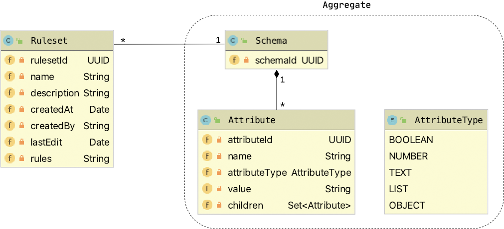

# Backend

The backend of openVALIDATION-IDE is a REST-API written in Java \(version 8\) with [Spring Boot](https://spring.io/projects/spring-boot) as the underlaying technology. 

## API-Documentation

You can find the official OpenAPI documentation through a Swagger-UI at [http://openvalidation-ide.azurewebsites.net/swagger-ui](http://openvalidation-ide.azurewebsites.net/swagger-ui).

## Simplified data model

### Ruleset

| Field | Description |
| :--- | :--- |
| `rulesetId` | Unique identifier of a ruleset |
| `name` | Name of the ruleset, shown in UI |
| `description` | Description of the ruleset, shown in UI |
| `createdAt` | Date of ruleset creation |
| `createdBy` | Actually a user name as a string, in future this will be a entity `User` |
| `lastEdit` | Date of last edit |
| `rules` | Contains all rules of a ruleset |

### Schema

| Field | Description |
| :--- | :--- |
| `schemaId` | Unique identifier of a schema |

### Attribute

| Field | Description |
| :--- | :--- |
| `attributeId` | Unique identifier of an attribute |
| `name` | Name of the attribute, shown in UI |
| `attributeType` | Type of attribute. Can be `BOOLEAN`, `NUMBER`, `TEXT`, `LIST`or`OBJECT`  |
| `value` | Is a string with a sample value of the attribute \(currently not in usage\) |
| `children` | An attribute can have sub-attributes, if the`attributeType` is `LIST` or `OBJECT` |

## Architecture & architectural decisions

Picture of architecture divided in: Web Layer, Service Layer and Repository Layer  
Service Layer: For encapsulating entities and controller \(through an additional service layer\).

### Schema as an own aggregate

In future a Schema can be shared, so the same Schema can be used in different Rulesets

### DTO's

One benefit of a Data Transfer Object \(DTO\) is, that we are free to decide for every special case, which information of our entities we want to reveal through our REST-API. Furthermore we have the freedom of changing our internal data model, without being forced to directly change our endpoints. We decided to implement DTO's inspired by CQRS-principles. We distinguish between three different kinds of DTO's:

| DTO-Type | Usage |
| :--- | :--- |
| General-DTO | DTO's which are given back to the user through the REST-API |
| Create-DTO | DTO's which are received through the request body of a HTTP-POST |
| Update-DTO | DTO's which are received through the request body of a HTTP-PUT |

The General-DTO gives us the opportunity, to only give that amount of information outwards, that we want to give to the consumer of our REST-API. Whereas the benefit of Create-and Update-DTO's are, to clearly specify which information we want to receive if an entity will be created or updated. This saves us a lot of validation work, because we always receive exactly the information we need in every case.

For mapping between DTO's and entities we use the external library [MapStruct](https://mapstruct.org/). Each entity has its own mapper.

### DatabaseInitializer

### Reset-Endpoint

## Unit- & Integration-Tests 

### 

