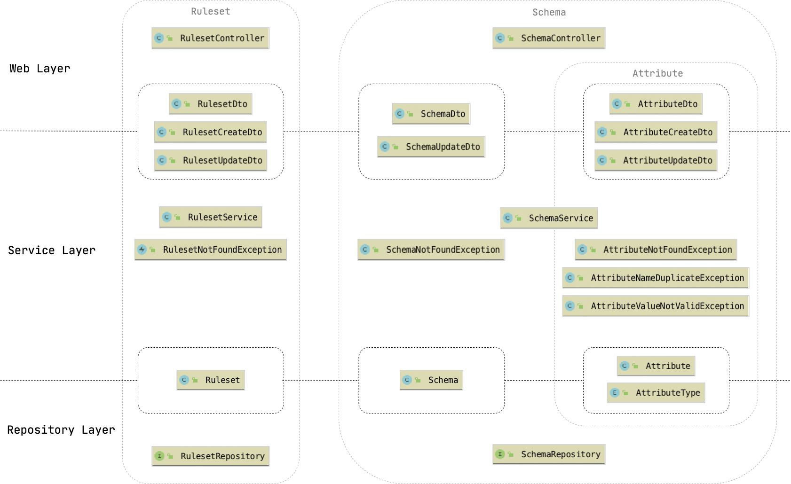
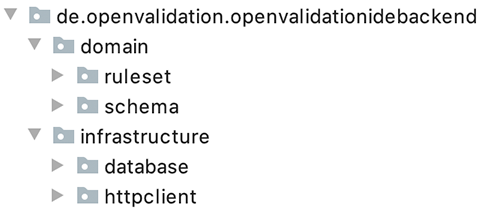

# Backend

The backend of openVALIDATION-IDE is a REST-API written in Java \(version 8\) with [Spring Boot](https://spring.io/projects/spring-boot) as the underlaying technology. 

## API-Documentation

You can find the official OpenAPI documentation through a Swagger-UI at [http://openvalidation-ide.azurewebsites.net/swagger-ui](http://openvalidation-ide.azurewebsites.net/swagger-ui).

## Simplified data model

### Ruleset

| Field | Description |
| :--- | :--- |
| `rulesetId` | Unique identifier of a ruleset |
| `name` | Name of the ruleset, shown in UI |
| `description` | Description of the ruleset, shown in UI |
| `createdAt` | Date of ruleset creation |
| `createdBy` | Actually a user name as a string, in future this will be a entity `User` |
| `lastEdit` | Date of last edit |
| `rules` | Contains all rules of a ruleset |

### Schema

| Field | Description |
| :--- | :--- |
| `schemaId` | Unique identifier of a schema |

### Attribute

| Field | Description |
| :--- | :--- |
| `attributeId` | Unique identifier of an attribute |
| `name` | Name of the attribute, shown in UI |
| `attributeType` | Type of attribute. Can be `BOOLEAN`, `NUMBER`, `TEXT`, `LIST`or`OBJECT`  |
| `value` | Is a string with a sample value of the attribute \(currently not in usage\) |
| `children` | An attribute can have sub-attributes, if the`attributeType` is `LIST` or `OBJECT` |

## Architecture & architectural decisions

The architecture of the openVALIDATION-IDE is divided through a Web-, Service- and Repository Layer. The basic idea behind this is that only contiguous layers communicate to each other. Furthermore, method calls always happen only from the upper to the lower layer.

The Web Layer only contains the controllers, whereas these controllers should be as "dumb" as possible. They should just forward the incoming API-calls to the services. Between the Web- and the Service Layer only Data Transfer Objects \(DTO\) are passed. Through the Service-Layer, entities and controllers are encapsulated. The services contain the business logic, what also ensures that the controllers remain clean. Also exception handling happens in the services. Between the Service- and the Repository Layer, only entities are passed. The Repository Layer only contains the repositories. 

### Package structure

The structure of packages is inspired by Domain-Driven-Design. 

The package `domain` holds all classes that are part of the domain. Inside of the `domain` package, there is a sub-package for each aggregate. The packages for the aggregates, which are `ruleset` and the `schema`, contain all the classes which belong to this aggregate. We decided, that only entities will get an own package below the aggregate packages. All other classes remain on the root of the aggregate/entity package.

The `infrastructure` package contains all classes for configuration of the infrastructure. In the package database are the classes for initializing and resetting the database \(see section [Initialize and reset the database](https://docs.openvalidation.io/contribution/developer-guide/ide/backend#initialize-and-reset-the-database)\). The package `httpclient` contains a class `CorsConfig` for configuring the CORS-Header.

### Schema as an own aggregate

We decided to treat the schema as an own aggregate and independently of a ruleset, because it should be possible to share schemas between rulesets.

Currently, a new schema will be created by creating a ruleset. At the moment it is also not possible to manage schemas independent of a ruleset. There is an [issue](https://github.com/openvalidation/openvalidation-ide/issues/166) about that on GitHub, this is one of the next items on the agenda.

### DTO's

One benefit of a DTO is, that we are free to decide for every special case, which information of our entities we want to reveal through our REST-API. Furthermore we have the freedom of changing our internal data model, without being forced to directly change our endpoints. We decided to implement DTO's inspired by CQRS-principles. We distinguish between three different kinds of DTO's:

| DTO-Type | Usage |
| :--- | :--- |
| General-DTO | DTO's which are given back to the user through the REST-API |
| Create-DTO | DTO's which are received through the request body of a HTTP-POST |
| Update-DTO | DTO's which are received through the request body of a HTTP-PUT |

The General-DTO gives us the opportunity, to only give that amount of information outwards, that we want to give to the consumer of our REST-API. Whereas the benefit of Create-and Update-DTO's are, to clearly specify which information we want to receive if an entity will be created or updated. This saves us a lot of validation work, because we always receive exactly the information we need in every case.

For mapping between DTO's and entities we use the external library [MapStruct](https://mapstruct.org/). Each entity has its own mapper.

## Initialize and reset the database

### DatabaseInitializer

The `DatabaseIntializer` is responsible for initializing the database with some sample data. The initialization will be executed at the application startup. Initial data will only be created, if the database is empty. Also, there are some out commented rules in the `DatabaseInitializer`. We have taken all sample rules from the [official playground](https://playground.openvalidation.io/) of openVALIDATION. Especially rules are commented out, where the syntax highlighting is not correctly shown in the openVALIDATION-IDE. The syntax highlighting is shown wrong, because currently \(April 18, 2020\) the [language server](https://github.com/openvalidation/openvalidation-languageserver) does not provide finely granulated information on syntax highlighting, so that we could correctly syntax highlight these rules. Nevertheless, we have already prepared the rules so that they can easily be uncommented as soon as the [language server](https://github.com/openvalidation/openvalidation-languageserver) provides the necessary information for syntax highlighting.

### Reset-Endpoint

There is a API-endpoint `/reset` for resetting the database to an initial state. This API-endpoint was implemented, because currently \(April 18, 2020\) the openVALIDATION-IDE does not provide a user management and everybody can play around with the rules at the [official demo](https://openvalidation-ide-ui.azurewebsites.net/) of openVALIDATION-IDE. This endpoint will be called once a day by a cron-job, so that the online-data is always clean.

## Unit- & Integration-Tests 

### 

