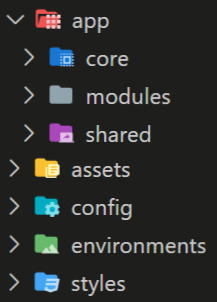

# Frontend

The user-facing part of openVALIDATION-IDE is realized as a single page web application powered by the [angular framework](https://angular.io/). TypeScript is used as the main programming language while HTML and SCSS are utilized for markup and styling respectively.

After you've cloned the [repository](https://github.com/openvalidation/openvalidation-ide) you can install all dependencies through [npm](https://www.npmjs.com/get-npm) using the command`npm install`. Depending on whether you've installed the angular command line tools on your machine globally or not, you can then compile and start the app by running `ng serve` or `npx ng serve`respectively.

## Project structure & architecture

The structure of the application tries to comply with both the official recommendations in regards to [modularization](https://angular.io/guide/module-types) as well as with general best practices regarding scaling angular project architecture. The following figure displays how the general project structure is composed. Each of the areas shown will get further discussed in more detail throughout this section.

### Core Module

First up inside the app folder, we find the core module among others. While the figure only shows the physical file location of the aforementioned modules, the indicated structure is also reflected in the setup of angular modules. The core module is a service module containing and providing singleton services for app-wide cross-cutting concerns like error handling, theme switching, and [backend access](frontend.md#openapi-client-generation).

### Shared Module

In Angular terminology best classified as a widget module, the shared module declares components, directives, and pipes used across the entire application. It is also used to import and then re-export commonly used modules from the Angular core and [Angular Material](https://material.angular.io/) UI component library. Since the shared module itself is used by each feature module, the modules mentioned before do then not have to be explicitly imported again.

### Feature Modules

Structuring code into cohesive chunks of functionality called [feature modules](https://angular.io/guide/feature-modules) is a best practice for angular applications. The feature modules of openVALIDATION-IDE reside inside the modules folder shown in the overview figure from before. Currently the application is made up of four different feature modules. These are: ruleset-editor, ruleset-ide, ruleset-management and ruleset-testsuite.

**ruleset-management:** Concerned with general management and selection of rulesets. It declares two components, one representing an input form for the creation of a ruleset and another one that displays a collection of rulesets to serve as an overview to look at and select rulesets.

**ruleset-editor:** Declares a code editor component with support for openVALIDATION syntax through language server integration for which it provides a corresponding service. For further information about the inner workings of syntax highlighting and linting please refer to the separate section about the [Monaco Editor integration](frontend.md#monaco-editor-integration).

**ruleset-ide:** Expands on the previously mentioned editor module with additional functionality like the visualization of errors, extraction, and display of important variables and the means to manipulate schema attributes. After all, this is the place where everything comes together to provide the user with an integrated development environment for everything rule-set related.

**ruleset-testsuite:** While not being fully implemented just yet, the test-suite module once completed, will provide the means of defining and then automatically validating test cases. For the time being, this functionality is just implied through a visual mockup tho. Nonetheless, a gauge-chart component intended  to illustrate test outcomes is already in a finished state.

### Additional relevant Areas

Referring back to the overview figure from the beginning of this section there are still four additional areas left not mentioned yet. First, there is the **assets** folder currently primarily containing static images for logos, icons but also some additional configuration to fulfill the special requirements of every platform.

Angular allows for CSS rules to be isolated and bound to specific components. This approach is used throughout the App wherever applicable. There is still the need for some global style definitions tho. These reside inside the **styles** folder. Further elaboration on the topic can be found in the section about [theming](frontend.md#theme).

**Environment** files containing static information are a vehicle used by angular to define an exchangeable configuration for different build targets. The **config** folder serves the same purpose with the key difference that it is not consumed by the angular compiler and ending up backed into the build artifacts. Why this is important for the way this application is intended to be deployed and additional information about available configuration options will be discussed in a separate section: [Environmental variables](frontend.md#environmental-variables).

## OpenAPI client generation

Access to the backend is established by utilizing an auto-generated backend client which is created using an  [OpenAPI](https://www.openapis.org/) spec file provided by the [backend](backend.md).

## Theme

## Monaco Editor integration

### Syntax highlighting

### Tokenizer

### Linting

## Environmental variables

talk about docker & nginx !

