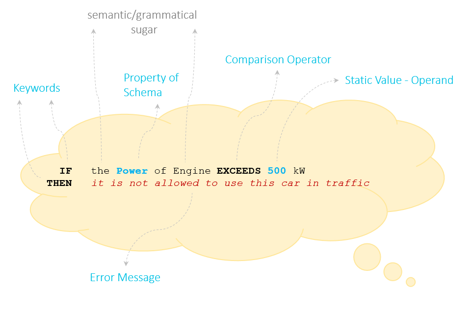

# Grammar

The language of openVALIDATION has a very special grammar. It is both formal and natural. On the one hand, naturalness contributes to overcoming the technical hurdles of a language that is too formal. On the other hand, the remaining formality of the basic structure enables mechanical processing.

The grammar already exists in two languages: English and German. Other languages can be added relatively quickly.

















  

