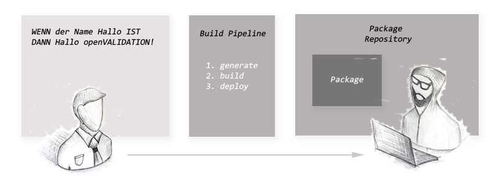

# Regeln integrieren


openVALIDATION ist ein multilingualer Crosscompiler. Dieser Compiler kann eine der natürlichen Sprachen wie z.B. Deutsch oder Englisch in eine der Programmiersprachen wie Java, C\#, JavaScript oder Python übersetzen. Logischerweise versteht openVALIDATION nicht die volle Bandbreite einer natürlichen  Sprache, sondern die Domäne der Validierungsregeln. Wichtig zu verstehen ist, dass am Ende eines Kompiliervorgangs Programmcode entsteht. Diesen Code kann der Entwickler in seiner Anwendung an der entsprechenden Stelle integrieren. Der erzeugte Code besteht aus 2 Komponenten: 

* Die Implementierung der eigentlichen Validierungsregeln 
* Und dem generischen Validation Framework  

## Implementierungsbeispiel 

Damit Du den Integrationsprozess besser verstehst, sollten wir als Erstes ein kleines „Hallo Validation!“ Beispiel implementieren. openVALIDATION funktioniert grundsätzlich technologieübergreifend. Allerdings ist es für unser Beispiel notwendig, dass wir eine konkrete Technologie verwenden. An dieser Stelle haben wir uns für Node.js entschieden. Die Integration in andere Technologie Stacks funktioniert ähnlich.

Für dieses Beispiel werden folgende Voraussetzungen benötigt:

Java Version                                          [1.8](https://www.oracle.com/technetwork/java/javase/downloads/jre8-downloads-2133155.html)  
NodeJS\(inkl. npm\) ab der Version     [8.5](https://nodejs.org/en/download/)  
Postman                                                 [LATEST](https://www.getpostman.com/downloads/)  
  
[ ](https://downloadarchive.blob.core.windows.net/openvalidation-generator/openvalidation.jar)[ ](http://13.93.15.207/openvalidation.jar)  


### 1. REST Service erstellen



`WINDOWS TASTE` drücken, "CMD" eingeben und mit `RETURN` die Konsole öffnen.  
Zunächst erstellen wir ein Projektverzeichnis.

```bash
md C:\tmp\nodeservice
cd c:\tmp\nodeservice
```



Öffne  dazu Deine Shell und gib die folgenden Befehle ein:

```bash
mkdir /tmp/nodeservice
cd /tmp/nodeservice
```



Node.js Projekt initialisieren



```bash
npm init -f
echo > index.js
```



```bash
npm init -f
echo > index.js
```



Somit haben wir ein leeres Node.js Projekt erstellt und können jetzt anfangen, den **REST** Service zu implementieren. Den vom **REST** Service benötigten Code schreiben wir jetzt in die _index.js._ Du kannst die Datei mit einem beliebigem Editor bearbeiten. In diesem Beispiel verwenden wir die atom IDE. Wir öffnen das zuvor erstellte Projektverzeichnis also mit atom.

```bash
atom .
```

Jetzt fügen wir folgenden Node.js Code in die _index.js_  ein:

```javascript
var express = require('express');
var bodyParser = require('body-parser');

var app = express();
app.use(bodyParser.json());

app.get('/', function (req, res) {
	  res.send('Hello World!');
});

app.listen(3000, function () {
	  console.log('openVALIDATION REST Service listening on port 3000...');
});
```

Als Nächstes installieren wir ein npm package namens "express". Express vereinfacht die Implementierung von REST Services unter Node.js.

```bash
npm install express --save
```


### 2. REST Service testen

Der REST Service ist nun startklar und es kann losgehen. Wir starten unseren REST Service:

```bash
node index.js
```

In der Konsole sehen wir jetzt folgende Ausgabe.

```text
openVALIDATION REST Service listening on port 3000...
```

Wir können unseren REST Service testen, indem wir entweder im Browser oder beispielsweise im Postman einen GET Request auf [http://localhost:3000/](http://localhost:3000/) absenden.


Der Service läuft und macht, was er soll. Aktuell besitzt unser REST Service lediglich eine einfache GET Operation, die im Response "Hello World!" zurückliefert. Jetzt möchten wir den Service um eine weitere Service Operation erweitern, in der gesendete Daten validiert werden sollen. Dazu stoppen wir mit `STRG+C` den laufenden Service. 

Wir öffnen die _index.js_  in einem Texteditor und ergänzen diese um eine weitere Service Operation. Wir fügen dazu eine POST Methode direkt hinter der GET Methode hinzu.

```javascript
...

app.get('/', function (req, res) {
	  res.send('Hello World!');
});

app.post('/', function (req, res) {
	  res.send('Hello World!');
});

...
```

Jetzt können wir direkt unter [http://localhost:3000/](http://localhost:3000/) auch Post Requests absenden. Du kannst den Server gerne nochmal starten und ihn mit Postman testen. Nachdem wir unsere Validierungsregel erstellt haben, werden wir an diese Stelle zurückkehren, um den generierten Code in die POST Operation zu integrieren.  


### 3. Eine Validierungsregel erstellen

Ok wir sind jetzt bereit zum Erstellen einer einfachen Validierungsregel. Und so soll sie aussehen:

```coffeescript
WENN  der Name IST Hallo
DANN  Hallo openVALIDATION!
```

Die Aufgabe dieser Regel ist ganz einfach. Wenn das Attribut "Name" den Wert "Hallo" enthält, dann wird eine Fehlermeldung mit dem Inhalt "Hallo openVALIDATION!" erzeugt. Dafür benötigen wir jedoch noch ein Schema.


### 4. Schema definieren

Damit das Attribut "Name" innerhalb der Regel eindeutig erkannt wird, müssen wir zusätzlich zu der eigentlichen Validierungsregel noch das entsprechende Schema an openVALIDATION übergeben. Das Schema kann in verschiedenen Formaten übergeben werden. Die einfachste Möglichkeit ist die Definition als JSON Objekt, aus dem openVALIDATION dann automatisch das entsprechende JSON Schema ableitet. Weitere Möglichkeiten sind YAML oder XSD, bzw. XML. Und so sieht unser Schema aus:



```yaml
Name : string
```



```javascript
{
    Name : "string"
}
```




### 5. Validierungsregeln in Nodejs bzw. in JavaScript Code übersetzen

Als Nächstes generieren wir den entsprechenden Programmcode anhand unserer Regel und des entsprechenden Schemas. Wir öffnen dazu eine neue Konsole und geben folgenden Befehl mit den entsprechenden Parametern ein:



```bash
java -jar openvalidation.jar ^
     -r   "WENN der Name IST Hallo DANN Hallo openVALIDATION!" ^
     -s   "{Name:'String'}" ^
     -o   "C:\tmp\nodeservice\expressVALIDATION.js" ^
     -l   node ^
     -c   de
```



```bash
java -jar openvalidation.jar \
     -r   "WENN der Name IST Hallo DANN Hallo openVALIDATION!" \
     -s   "{Name:'String'}" \
     -o   "C:\tmp\nodeservice\expressVALIDATION.js" \
     -l   node \
	 -c   de
```



Wenn alles gut gelaufen ist, müsstest Du folgende Meldung in der Konsole sehen:

```text
### code generation successfully completed!
### COMPILATION FINISHED.
```

Im Projektverzeichnis wurden 2 Dateien erzeugt. _HUMLFramework.js_ und _expressVALIDATION.js._ Diese beiden Dateien enthalten die fertig implementierten Validierungsregeln. Jetzt können wir den generierten Code in unseren REST Service implementieren.


### 6. Den generierten Code in die Anwendung integrieren

Wir kehren zurück zu unserer _index.js_ und importieren dort als Erstes das expressVALIDATION Modul.

```javascript
var openVALIDATION = require('./expressVALIDATION.js');
```

Anschließend fügen wir den Aufruf der Validierung in die POST Methode:

```javascript
app.post('/', function (req, res) {
	var validationRESULT = openVALIDATION.validate(req.body);

	if (validationRESULT.hasErrors)
		res.status(500).json(validationRESULT.errors)
	else
	  	res.send('Hello World!');
});
```

Mit `openVALIDATION.validate(req.body)` führen wir den eigentlichen Validierungsvorgang durch. Der `req.body` enthält den entsprechenden Datensatz, der zur Laufzeit validiert werden soll. Anschließend überprüfen wir, ob `validationRESULT` Fehler enthält. Sollte das der Fall sein, setzen wir den `Response Status` auf `500` und geben die entsprechenden Fehler im Response mit. Wenn es keine Fehler gab, wird einfach "Hello World!" ausgegeben. 

Nochmal zur Erinnerung: Unsere Validierungsregel prüft, ob das Attribut "Name" im Request den Wert "Hallo" enthält. Und wenn Ja, dann wird eine Fehlermeldung erzeugt.


### 7. Daten an den Service senden und validieren

Ok, jetzt sind wir endlich soweit, dass wir die fertige Validierungsregel testen können. Wir starten also nochmal den REST Service und testen mit Postman, was passiert.

```bash
node index.js
```

Wir starten Postman und erstellen den entsprechenden POST Request:



```yaml
Name : Hallo
```



```javascript
{
	"Name" : "Hallo"
}
```



Und so sieht der Request und der entsprechende Response im Postman aus:


Wenn wir den Wert des Attributes `Name` auf **"Hallo"** setzen, kommt wie gewünscht die entsprechende Fehlermeldung im Response. Wenn wir den Wert verändern, dann kommt die Fehlermeldung nicht mehr. Herzlichen Glückwunsch, Du hast soeben deine erste Validierungsregel implementiert!


## Die Erstellung von Validierungsregeln und die Entwicklung der eigentlichen Software voneinander trennen

Der größte Mehrwert bei openVALIDATION ergibt sich dadurch, dass man die Erstellung der Validierungsregeln denjenigen überlässt, die die jeweilige Domain-Expertise mitbringen. Das sind üblicherweise die Domainexperten bzw. die Fachleute. Es geht darum, dass man die Erstellung der Validierungsregeln vom technischen Kontext komplett isoliert, damit die Fachleute keine technischen Hürden auf sich nehmen müssen. 

Betrachten wir nochmal den Vorgang, mit dem wir über die CLI unsere Validierungsregel generiert haben. Wir haben dem Parameter `-r`  hier die Regel direkt als Text übergeben:

```bash
java -jar openvalidation.jar ^
     -r   "WENN der Name IST Hallo DANN Hallo openVALIDATION!" ^
     -s   "{Name:'String'}" ^
     -c   de
```

Allerdings kannst Du sämtliche Regeln auch in eine eigene Datei auslagern, beispielsweise in _MeineDomainRegeln.ov_ :


```coffeescript
WENN der Name IST Hallo 
DANN Hallo openVALIDATION!
```


Diese Datei kannst Du jetzt ebenfalls als Parameter an die CLI übergeben:

```bash
java -jar openvalidation.jar ^     
     -r   MeineDomainRegeln.ov ^
     -s   "{Name:'String'}" ^
     -c   de
```

Der Vorteil dieser Trennung liegt darin, dass sich ein Domain-Experte ab jetzt ein vollkommen auf die Erstellung von Regeln konzentrieren kann, ohne dabei den technischen Kontext \(REST Service, Nodejs, Express usw.\) kennen oder verstehen zu müssen. Er muss lediglich den Inhalt der Datei _MeineDomainRegeln.ov_  verstehen und bearbeiten können. Mann kann die Datei auch auf einen Netzlaufwerk legen und den CLI-Aufruf beispielsweise in eine Build-Pipeline integrieren. Die Build-Pipeline könnte somit ein NPM-Package erzeugen und dieses in ein Package-Repository bereitstellen. Der Entwickler würde anschließend die fertig implementierten Regeln wie jedes andere NPM-Package beziehen:

```bash
npm install meinedomainregeln --save
```

Somit wäre es egal, ob diese Regeln von einem anderen Entwickler per Hand oder von einem Domain-Experten + openVALIDATION erzeugt werden. Am Ende liegt ein Package in einem Package-Repository!



## Das integrierte Validierungs-Framework 

Bei der Entwicklung der Codegeneratoren war uns besonders wichtig, dass der generierte Code keinerlei Abhängigkeiten zu irgendwelchen Programmbibliotheken bzw. externen Packages enthält. Das macht den Code flexibel und überall einsetzbar. Der generierte Code kann zum Beispiel in einem REST Service verwendet werden, um die Daten am Eingang einer Service Operation zu validieren. Genauso gut kann aber auch derselbe Code in einer Frontend Anwendung integriert werden. Damit das möglich ist, verzichtet openVALIDATION auf jegliche Abhängigkeiten bei der Generierung des Codes. Das ist der Grund, warum die generierten Regeln ein eigenes Framework mitbringen. 

Das Framework ist so aufgebaut, dass die Implementierung der Regeln in verschiedenen Programmiersprachen möglichst gleich aussieht. Somit dient das Framework als eine Art Normalisierungsschicht für den generierten Output. Dadurch ist es relativ einfach weitere Codegeneratoren bzw. weitere Programmiersprachen zu openVALIDATION hinzuzufügen. Zusätzlich sieht dadurch die Integration des Codes in verschiedenen Technologie Stacks ebenfalls homogen aus. Ein wichtiger Teil der Normalisierung sorgt dafür, dass anstatt Vergleichsoperatoren die entsprechenden Methoden bzw. Funktionen verwendet werden. Diese sind im Framework Datentypen-übergreifend implementiert. Weitere domänenspezifische Vergleichsoperatoren können bei Bedarf ebenfalls schnell hinzugefügt werden.

