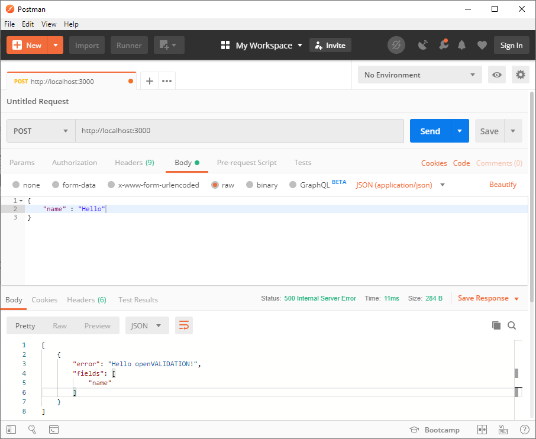

# Rules integration


openVALIDATION is a multilingual cross compiler. This compiler can translate one of the natural languages such as German or English into one of the programming languages such as Java, C\#, JavaScript or Python. Logically, openVALIDATION does not understand the full range of a natural language, but the domain of validation rules. It is important to understand that program code is generated at the end of a compilation process. The developer can integrate this code into his application at the appropriate point. The generated code consists of two components:

* Implementation of the actual validation rules 
* And the generic validation framework 

## Implementation example 

In order for you to better understand the integration process, the first thing we need to do is to add a little hello validation! openVALIDATION basically works across technologies. However, for our example it is necessary that we use a concrete technology. At this point we decided to use Node.js. The integration into other technology stacks works in a similar way.

The following prerequisites are required for this example:

Java Version                                          [1.8](https://www.oracle.com/technetwork/java/javase/downloads/jre8-downloads-2133155.html)  
NodeJS \(inkl. npm\) from version       [8.5](https://nodejs.org/en/download/)  
Postman                                                 [LATEST](https://www.getpostman.com/downloads/)

[ ](https://downloadarchive.blob.core.windows.net/openvalidation-generator/openvalidation.jar)

### 1. Creating a REST Service



Press `WINDOWS KEY`, enter "CMD" and open the console with `RETURN`. First we create a project directory.

```bash
md C:\tmp\nodeservice
cd c:\tmp\nodeservice
```



Open up your shell and enter the following commands:

```bash
mkdir /tmp/nodeservice
cd /tmp/nodeservice
```



Initialize Node.js project



```bash
npm init -f
echo > index.js
```



```bash
npm init -f
echo > index.js
```



So we have created an empty Node.js project and can now start implementing the **REST** service. The code required by the **REST** service is now written in the _index.js_. You can edit the file with any editor. In this example we use the atom IDE. So we open the previously created project directory with atom.

```bash
atom .
```

Now we add the following Node.js code to the _index.js_:

```javascript
var express = require('express');
var bodyParser = require('body-parser');

var app = express();
app.use(bodyParser.json());

app.get('/', function (req, res) {
	  res.send('Hello World!');
});

app.listen(3000, function () {
	  console.log('openVALIDATION REST Service listening on port 3000...');
});
```

Next we install an npm package called "express". Express simplifies the implementation of REST services on Node.js.

```bash
npm install express --save
```


### 2. Testing the REST Service

The REST service is now ready to go. We start our REST service:

```bash
node index.js
```

In the console we now see the following output:

```text
openVALIDATION REST Service listening on port 3000...
```

We can test our REST service by sending a GET request to [http://localhost:3000/](http://localhost:3000/) either in the browser or, for example, in Postman.


The service runs and does what it's supposed to. Currently, our REST service only has a simple GET operation, which returns "Hello World! Now we would like to extend the service by another service operation, in which sent data should be validated. Therefore we stop the current service with `STRG+C`.

We open the _index.js_ in a text editor and add another service operation. We add a POST method directly after the GET method.

```javascript
...

app.get('/', function (req, res) {
	  res.send('Hello World!');
});

app.post('/', function (req, res) {
	  res.send('Hello World!');
});

...
```

Now we can send Post Requests directly to [http://localhost:3000/](http://localhost:3000/) as well. You are welcome to restart the server and test it with Postman. After we have created our validation rule, we will return to this point to integrate the generated code into the POST operation.  


### 3.  Creating a Validation Rule

Ok we are now ready to create a simple validation rule. And this is what it should look like:

```coffeescript
  IF the name IS Hello
THEN hello openVALIDATION!
```

The task of this rule is quite simple. If the attribute "Name" contains the value "Hello", then an error message is generated with the content "hello openVALIDATION!" For this we need a schema.


### 4. Defining a Schema

In order for the attribute "Name" to be uniquely recognized within the rule, we must pass the corresponding schema to openVALIDATION in addition to the actual validation rule. The schema can be passed in different formats. The simplest option is to define it as a JSON object, from which openVALIDATION then automatically derives the corresponding JSON schema. Further possibilities are YAML or XSD, or XML. And this is how our schema looks like:



```yaml
name : string
```



```javascript
{
    name : "string"
}
```




### 5. Translate validation rules into Node.js or JavaScript code

Next, we generate the corresponding program code based on our rule and the corresponding schema. We open a new console and enter the following command with the corresponding parameters:



```bash
java -jar openvalidation.jar ^
     -r   "IF the name IS Hello THEN Hello openVALIDATION!" ^
     -s   "{name:'String'}" ^
     -o   "C:\tmp\nodeservice\expressVALIDATION.js" ^
     -l   node ^
     -c   en
```



```bash
java -jar openvalidation.jar \
     -r   "IF the Name IS Hallo THEN Hallo openVALIDATION!" \
     -s   "{name:'String'}" \
     -o   "C:\tmp\nodeservice\expressVALIDATION.js" \
     -l   node \
     -c   en
```



If everything went well, you should see the following message in the console:

```text
### code generation successfully completed!
### COMPILATION FINISHED.
```

Two files were created in the project directory. HUMLFramework.js and expressVALIDATION.js. These two files contain the implemented validation rules. Now we can implement the generated code in our REST service.


### 6. Integrate generated code into an application

We return to our _index.js_ and import the expressVALIDATION module first.

```javascript
var openVALIDATION = require('./expressVALIDATION.js');
```

Then we add the call of the validation into the POST method:

```javascript
app.post('/', function (req, res) {
	var validationRESULT = openVALIDATION.validate(req.body);

	if (validationRESULT.hasErrors)
		res.status(500).json(validationRESULT.errors)
	else
	  	res.send('Hello World!');
});
```

We perform with `openVALIDATION.validate(req.body)` the actual validation process. The `req.body` contains the corresponding data set to be validated at runtime. Then we check whether `validationRESULT` contains errors. If this is the case, we set the `response status` to `500` and include the corresponding errors in the response. If there were no errors, we simply output "Hello World!

Remember: Our validation rule checks whether the attribute "Name" in the request contains the value "Hello". And if Yes, then an error message is generated.

### 7. Sending and Validating Data to a Service

Ok, now we are finally ready to test the finished validation rule. So we start the REST service again and test with Postman what happens.

```bash
node index.js
```

We start Postman and create the corresponding POST request:



```yaml
name : Hello
```



```javascript
{
	"name" : "Hello"
}
```



And this is how the request and the corresponding response look like in Postman:



If we set the value of the `Name`attribute to "**Hello**", the corresponding error message is displayed in the response as required. If we change the value, the error message no longer appears. Congratulations, you have just implemented your first validation rule!


## Separate the creation of validation rules from the development of the software itself

The greatest added value of openVALIDATION results from the fact that the creation of validation rules is left to those who have the relevant domain expertise. These are usually the domain experts. The point is to completely isolate the creation of validation rules from the technical context so that the experts do not have to take on any technical hurdles.

Let's look again at the process by which we generated our validation rule via the CLI. We passed the rule directly to the parameter `-r` as text:

```bash
java -jar openvalidation.jar ^
     -r   "IF the Name IS Hello THEN Hello openVALIDATION!" ^
     -s   "{name:'String'}" ^
     -c   en
```

Or into a separate file. In e.g. myDomainRules.ov


```coffeescript
  IF the Name IS Hello 
THEN Hello openVALIDATION!
```


You can now also pass this file as a parameter to the CLI:

```bash
java -jar openvalidation.jar ^     
     -r   myDomainRules.ov ^
     -s   "{name:'String'}" ^
     -c   en
```

The advantage of this separation is that from now on, domain experts can focus completely on creating these rules without having to know or understand the technical context \(REST Service, Nodejs, Express etc.\). All they need to do is understand and edit the content of the MyDomainRules.ov file. You can also place the file on a network drive and integrate the CLI call e.g. into a build pipeline. The BuildPipeline could create an NPM package and deploy it to a package repository. The developer would then obtain ready-implemented rules like any other NPM package:

```bash
npm install mydomainrules --save
```

So it wouldn't matter if these rules were created by another developer by hand or by a domain expert + openVALIDATION. At the end there is a package in a package repository!


## The Integrated Validation Framework 

During the development of the code generators it was especially important to us that the generated code does not contain any dependencies to any program libraries or external packages. This makes the code flexible and usable everywhere. For example, the generated code can be used in a REST service to validate the data at the input of a service operation. The same code can also be integrated into a frontend application. To make this possible, openVALIDATION avoids any dependencies when generating the code. This is the reason why the generated rules have their own framework.

The framework is structured so that the implementation of the rules in different programming languages looks as similar as possible. Thus, the framework serves as a kind of normalization layer for the generated output. This makes it relatively easy to add additional code generators or programming languages in openVALIDATION. And the integration of the code in different technology stacks also looks homogeneous. An important part of normalization is to ensure that the corresponding methods or functions are used instead of comparison operators. These are implemented across data types in the framework. Further domain-specific comparison operators can be added relatively quickly if required.

