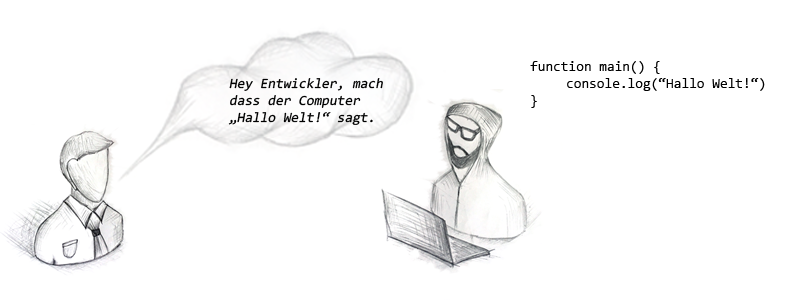

# Was uns antreibt

Nun ist die Digitale Revolution da, und wie es aussieht geht sie nicht mehr weg. 

Herbert Diess, Chef des größten Automobilherstellers der Welt, sagte vor Kurzem: "Wir entwickeln uns zu einer Software-Firma." Mit dieser Meinung ist sein Unternehmen, die Volkswagen AG, nicht allein. Bereits seit Jahren hört man ähnliche Aussagen von Vertretern verschiedener Branchen, unter anderem auch aus der Banken- und Versicherungswirtschaft. De facto gibt es keine IT-Branche mehr, denn  Informationstechnologie ist allgegenwärtig. 

Diese Entwicklung beschert einigen von uns sehr rosige Aussichten. Die Türen stehen weit offen, die Sonne strahlt, der Himmel ist blau und die Vögel zwitschern! Tatsache ist, dass Digitalisierung weitaus mehr Aufgaben mit sich bringt, als es Menschen gibt, die in der Lage sind, diese zu erledigen. Das ist der Grund, warum bereits seit Jahren ununterbrochen IT-Fachkräfte gesucht werden.

> "Wo viel Licht ist, ist auch viel Schatten.",   
> _Johann Wolfgang von Goethe_

Was für eine Glanzzeit für diejenigen, die das Digitale in ihrer DNA tragen. Doch die Schatten dieser Entwicklung sind enorm. Digitalisierung bedeutet vor allem Automatisierung. Sie führt dazu, dass jemand, der heute eine Verwaltungsaufgabe ausübt, ab morgen nicht mehr benötigt wird, da er durch ein Computerprogramm ersetzt wird. Es gibt also eine Menge Menschen da draußen, deren Fähigkeiten in der Welt von Morgen als wertlos betrachtet werden. 

Auf der anderen Seite ist es egal, was wir tun. Wir schaffen es einfach nicht, genügend Technikversteher auszubilden oder umzuschulen. Mehrere unabhängige Studien belegen, dass der Anteil der Studienabbrecher unter den Informatikstudenten bei ca. 50% liegt. Das ist definitiv überdurchschnittlich hoch im Vergleich zu anderen Studiengängen. Unterm Strich bedeutet es, dass Informatik nach wie vor eine hochkomplexe Raketenwissenschaft ist. Indem wir die "Fähigen" von den "Unfähigen" knallhart trennen, wird das Problem des Fachkräftemangels nur noch größer. Es geht nicht darum, dass wir die Bildungsstandards senken. Auf gar keinen Fall. Wir benötigen nach wie vor sehr gut ausgebildete Informatiker. Die Frage ist nur, was passiert mit der überwältigenden Mehrheit der Menschen, die kein Teil dieser Technikelite sind?  

> Dieses Ungleichgewicht des digitalen Wandels birgt eine große Gefahr. Die Gefahr, eine der größten gesellschaftlichen Errungenschaften aller Zeiten zu verlieren. Nämlich die gesunde, recht zufriedene, solvente Mittelschicht.

**Wir sind der Meinung, dass der Digitale Wandel auf einem falschen Paradigma basiert.**

Seit Jahren versuchen wir verzweifelt Milliarden von Menschen technisches Verständnis aufzuzwingen. Diejenigen, die dieser Herausforderung gewachsen sind, werden reichlich belohnt. Alle anderen werden quasi als unfähig betrachtet. Der Fachkräftemangel und der Billiglohnsektor haben eine und dieselbe Ursache. Je technischer die Welt wird, desto mehr Technikfreaks und desto weniger Nichttechniker werden benötigt. So einfach ist es. 

Wir haben uns folgende Fragen gestellt:

* Ist ein technisches Verständnis tatsächlich ein Muss, um den Digitalen Wandel mitzugestalten? 
* Ist das Wissen eines Verwalters tatsächlich so wertlos, nur weil darin keine Portion Technik vorkommt?
* Werden tatsächlich 8 Milliarden Softwareentwickler benötigt, um die jeweiligen Herausforderungen der Digitalisierung zu meistern?

Wir glauben, die Antworten auf diese Fragen gefunden zu haben.  

**Wie wäre es, wenn wir das gängige Paradigma einfach umkehren.** **Anstatt allen 8 Milliarden Menschen die hochkomplexe Technik in ihre Köpfe zu hämmern, sollten wir lieber der Technik selbst etwas Menschlichkeit näherbringen.**

Eine Technologie ist oft nur eine Hürde und nicht wirklich die Lösung des Problems. Wir benötigen Werkzeuge, die der menschlichen Arbeitsweise entgegenkommen. Werkzeuge, die einfach und intuitiv zu bedienen sind und deren Nutzung kein dreijähriges Studium voraussetzt. 

**Wir sollten die Art und Weise wie Software entwickelt wird, radikal verändern!**

Eine Maschine, also der Computer ist ein hochtechnologisches Ding, welches ausschließlich eine hochtechnologische Sprache versteht. Diese Sprache enthält eine Menge kryptischer Symbole wie beispielsweise " &gt;!\#'\*§$%&&/\(\(\)". Es ist also kein Wunder, dass die meisten Menschen nichts damit anfangen können. Aus genau diesem Grund gibt es Softwareentwickler, welche die entsprechenden Programmiersprachen beherrschen. Eine Programmiersprache ist nicht nur kryptisch, sondern auch sehr formal. Sie ist exakt, verzeiht keine Fehler und erlaubt keine kreativen Einfälle. Sie wirkt sehr unnatürlich auf die Menschen, da Menschen in der Regel natürliche Sprachen zur Kommunikation untereinander verwenden. Programmiersprachen sind bis heute der primäre Weg, um einem Computer Befehle zu erteilen. Eine Software zu programmieren, bedeutet nichts anderes, als eine Arbeitsanweisung für einen Computer zu erstellen. Nur derjenige, der diese Sprache beherrscht, ist in der Lage eine Maschine mit neuen Fähigkeiten auszustatten. Der Softwareentwickler ist also eine Art Dolmetscher, der beide Sprachen spricht. Die Sprache der Menschen und die Sprache der Maschinen.

> Ein Softwareentwickler bildet den fundamentalen Bestandteil des Softwareentwicklungsprozesses. Er schreibt eben die Software. Ohne ihn geht’s einfach nicht.

Ist es wirklich so? Wir sind der Meinung, dass es doch anders geht! Wir können Software schreiben, deren Aufgabe es ist, wiederum andere Software zu schreiben. Klingt verwirrend, ist aber eigentlich ganz einfach. Wir ersetzen den Softwareentwickler durch ein Programm. Die Aufgabe dieses Programms ist es, die Anforderung in einer natürlichen Sprache zu erfassen und diese in eine Programmiersprache zu übersetzen. Also genau dieselbe Aufgabe, die ein Mensch, also der Softwareentwickler zuvor erledigt hat. Somit kann die Maschine selbst die natürliche, menschliche Sprache verstehen. Ein Sachbearbeiter wäre dann dazu in der Lage, ohne jegliches technisches Verständnis ein Computerprogramm oder zumindest einen Teil davon zu erstellen. Dazu müsste er dem Computer seine Verwaltungsexpertise nur noch in einer natürlichen Sprache vermitteln. Wir bezeichnen das als **No-Code Development**.

#### **Unsere Vision**

Wir sind fest davon überzeugt, dass wir demnächst dazu in der Lage sein werden, komplexe Software mittels natürlicher Sprache, sowohl geschrieben als auch gesprochen, zu programmieren. Mit openVALIDATION gehen wir einen kleinen Schritt in genau diese Richtung. Dank der Verwendung einer natürlichen Sprache, anstatt formaler Programmiersprachen, wird der digitale Wandel **jedem** eine faire Chance gewähren! 

**Unternehmen und deren Mitarbeiter können gleichermaßen davon profitieren**

Nicht nur der Verwalter selbst, sondern auch sein Unternehmen kann vom Einsatz von Werkzeugen, wie openVALIDATION, enorm profitieren. Viele Firmen stehen vor der Herausforderung, einerseits im Zuge der Prozessautomatisierung Stellen abzubauen, und andererseits zusätzliche Fachkräfte zu suchen. Wie wäre es, wenn niemand gehen müsste? Wenn es doch noch eine Möglichkeit gäbe, die neuen Herausforderungen mit den bestehenden Mitarbeitern zu bewältigen? Wenn beispielsweise unser Sachbearbeiter mit seiner fachlichen Expertise und ohne jegliches technisches Verständnis dasselbe tun könnte wie ein IT-Experte? Wir sind der Meinung, dass die **Verwendung einer natürlichen Sprache zur Spezifikation von Software in Kombination mit der Codegenerierung** die Lösung für genau dieses Problem ist!  

### Und was wird aus dem Softwareentwickler?

Einige Informatiker sind der Meinung, dass Softwareentwickler an ihrem eigenen Ast sägen, wenn sie die Aufgaben eines Softwareentwicklers automatisieren. Außerdem haben Softwareentwickler in der Regel mehrere Jahre gebraucht, um zu ihrem Wissen zu gelangen. Warum sollte es plötzlich jeder können, der diesen steinigen Weg nicht gegangen ist? Die Gegenfrage ist: Wofür setzt ein Entwickler heute seine Fähigkeiten ein? Erfüllt es ihn mit Sinn, wenn er die Buttons grün färbt und diese anschließend 2 Pixel nach links verschiebt oder wenn ein hochgebildeter Informatiker seit 10 Jahren immer wieder dieselben Online-Formulare baut. Oder wenn er 1000 Validierungsregeln als Excel-Tabelle von der Fachabteilung als Vorlage bekommt, um diese anschließend wochenlang in Programmcode zu übersetzen? Sind das die elitären Aufgaben, die ausschließlich dem kleinen Kreis der Technikversteher vorbehalten bleiben müssen? 

In einigen Projekten werden Programmierer oft als reine Dolmetscher eingesetzt. Die Konzeption, also die Denkarbeit wird oft von der Produktentwicklung, den Business Analysten bzw. von Requirement Engineers erledigt. Ein Entwickler bekommt lediglich eine Arbeitsanweisung in Form einer Fachspezifikation, anschließend in Programmcode übersetzen werden muss. Diese Tätigkeit ist in vielen Fällen absolut programmatisch und ideal dafür geeignet, automatisiert zu werden. Ein Entwickler sollte sich ausschließlich mit dem Teil der Software befassen, der nicht automatisierbar ist.

Wir sind fest davon überzeugt, dass Technologien wie openVALIDATION den Softwareentwickler absolut nicht überflüssig machen, sondern seine Arbeit im Kern verbessern, indem sie die lästige Fleißarbeit automatisieren.  

Wir, also die Technikversteher, sollten unsere Fähigkeiten dazu verwenden, die hochkomplexe Welt der Technologien zu vereinfachen, damit möglichst jeder daran partizipieren kann. Die Technologie soll uns Menschen dienen, und zwar uns allen!

_PS: Es sei denn die Technologie wird eines Tages tatsächlich so intelligent, dass sie ein eigenes Bewusstsein entwickelt. Spätestens dann sollten wir das Ding mit dem "dienen" evtl. überdenken ;-\)_

