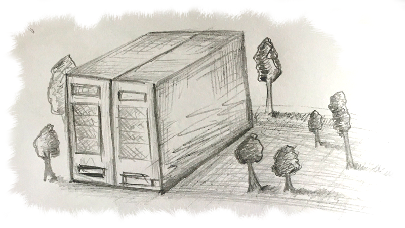
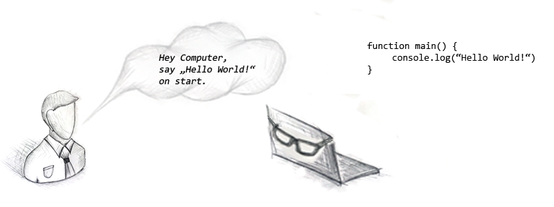

# What drives us

The digital revolution has arrived, and it doesn't seem to go away anymore. 

Herbert Diess, CEO of the world's largest automotive manufacturer, recently said: "We are evolving into a software company." His company, Volkswagen AG, is not alone in this opinion. For years now, similar statements have been heard from representatives of various sectors, including the banking and insurance industries. De facto, there is no IT industry anymore, because information technology is omnipresent.

This development gives some of us very bright prospects. The doors are wide open, the sun is shining, the sky is blue and the birds are chirping! The fact is that digitalization involves far more tasks than there are people who are able to handle them. This is the reason why IT professionals have been in constant demand for years.

> "Where there is much light, there is also much shadow",   
> _Johann Wolfgang von Goethe_

What a golden age for those who carry the digital in their DNA. But the shadows of this development are enormous. Digitization is all about automation. It means that someone who has an administrative task today will no longer be needed tomorrow because they will be replaced by a computer program. So there are a lot of people out there whose skills are considered worthless in tomorrow's world.

On the other hand, it doesn't matter what we do. We simply can't train or retrain enough technical experts. Several independent studies show that the proportion of dropouts among computer science students is about 50%. This is definitely above average compared to other courses. The bottom line is that computer science is still a highly complex rocket science. By sorting out the "capable" from the "incapable", the problem of the shortage of skilled workers becomes even greater. It is not a question of lowering educational standards. Absolutely not. We still need very well-trained computer scientists. The question is, what happens to the overwhelming majority of people who are not part of this technology elite?  

> This imbalance of digital change poses a great danger. The danger of losing one of the greatest social achievements of all time. Namely the healthy, quite satisfied solvent middle class.

**We believe that digital change is based on a false paradigm.**

For years we have been desperately trying to impose technical understanding on billions of people. Those who rise to the challenge are richly rewarded. Everyone else is seen as incompetent. The shortage of skilled workers and the low-wage sector have one and the same cause. The more technical the world becomes, the more technology freaks and the fewer non-technicians are needed. It is that simple.

We have asked ourselves the following questions:

* Is a technical understanding really a must in order to help shape digital change?
* Is the knowledge of an accounting clerk really so worthless just because it does not contain a portion of technology?
* Are 8 billion software developers actually needed to master the respective challenges of digitization?

We believe we have found the answers to these questions.  

**How about we just reverse the current paradigm. Instead of hammering the highly complex technology into the heads of all 8 billion people, we should rather bring some humanity closer to the technology itself.**

A technology is often only a hurdle and not really the solution to the problem. We need tools that accommodate the human way of working. Tools that are simple and intuitive to use and do not require three years of study.

**We should radically change the way software is developed!**

A machine, the computer, is a high-tech thing that only understands a high-tech language.This language contains a lot of cryptic symbols such as " &gt;!\#'\*§$%&&/\(\(\)". So it's no wonder that most people can't do anything with it. For exactly this reason, there are software developers who know the corresponding programming languages. A programming language is not only cryptic, but also very formal. It is exact, forgives no mistakes and does not allow any creative ideas. It has a very unnatural effect on people, since they usually use natural languages to communicate with each other. Until today, programming languages are the primary way to give commands to a computer. Programming software is nothing more than creating a work instruction for a computer. Only those who master this language are able to equip a machine with new capabilities. The software developer is a kind of interpreter who speaks both languages. The language of people and the language of machines.

> A software developer is the fundamental component of the software development process. He writes the software. It simply doesn't work without him.

Is it really like that? We are of the opinion that there is another way! We can write software whose task it is to write other software. Sounds confusing, but is actually quite simple. We replace the software developer with a program. The task of this program is to capture the requirement in a natural language and translate it into a programming language. So it's exactly the same task that a human being, the software developer, has done before. Thus, the machine itself could understand the natural, human language. The accounting clerk would be able to create a computer program or at least a part of it without any technical understanding. All he has to do is convey his administrative expertise to the computer in a natural language. We call this **NoCode Development**.

**Our Vision**

We firmly believe that we will soon be able to program complex software using natural language, both written and spoken. With openVALIDATION we are taking a small step in exactly this direction. Thanks to the use of a natural language instead of formal programming languages, digital change would give **everyone** a fair chance!

**Companies and their employees can benefit equally from it**

Not only the accounting clerk himself, but also his company can benefit enormously from the use of tools such as openVALIDATION. Many companies are faced with the challenge of cutting jobs in the course of process automation on the one hand, and looking for additional specialists on the other. What would it be like if nobody had to leave? What if there were still an opportunity to master the new challenges with existing employees? If, for example, our accounting clerk, with his technical expertise and without any technical understanding, could do the same as an IT expert? We believe that **using a natural language to specify software in combination with code generation** is the solution to this problem!  

### And what about the software developer?

Some computer scientists believe that software developers are sawing at their own branch when they automate the tasks of a software developer. In addition, it usually took software developers several years to acquire their knowledge. Why should anyone who hasn't walked this stony path suddenly be able to? The counter question is: What does a developer use his skills for today? Does it make sense for him to color the buttons green and then move them 2 pixels to the left or if a highly educated computer scientist has been building the same online forms over and over again for 10 years? Or if he receives 1000 validation rules as an Excel spreadsheet as a template from the specialist department, which he then translates into program code for weeks? Are these the elitist tasks that have to be reserved exclusively for the small circle of technical experts?

In some projects, programmers are often used as pure interpreters. The conception, i.e. the mental work, is often done by the product development, the business analysts or requirement engineers. The developer simply receives a work instruction in the form of a technical specification, which he then has to translate into program code. In many cases, this activity is absolutely programmatic and ideally suited to be automated. A developer should only deal with the part of the software that cannot be automated.

We are firmly convinced that technologies like openVALIDATION do not make the software developer redundant at all, but improve the core of his work by automating the tedious hard work.  

We, the technology experts, should use our skills to simplify the highly complex world of technology so that everyone can participate in it. Technology should serve us humans, all of us!

_PS: Unless the technology one day actually becomes so intelligent that it develops its own consciousness. At the latest then we should possibly rethink the thing with the "serve" ;-\)_

